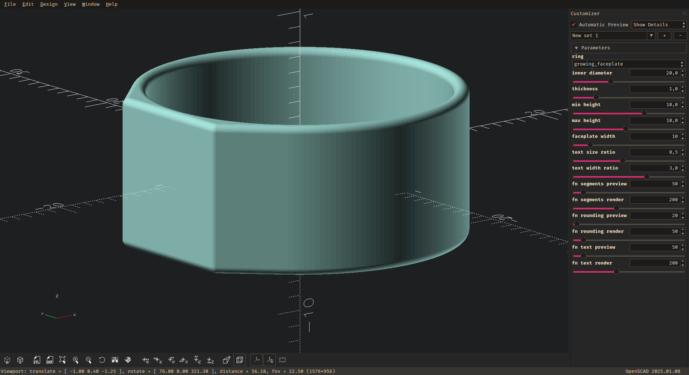

# Openscad Rings

This openscad file is able to generate different kinds of Rings.

The rings can be customized using the openscad customizer.

### growing faceplate ring

### basic ring

### rounded basic ring

### basic faceplate ring

### rounded faceplate ring

This is not a selectable module, however it can still be achieved by setting the min height and max height to the same value for the growing faceplate ring

### size test

The size test prints the inner diameter of the ring on the faceplate

